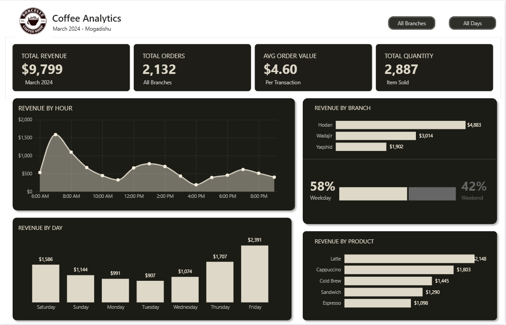

# Project Background
Savanna Brews is a Mogadishu-based coffee shop chain established in 2021, serving customers across three city branches — Hodan, Wadajir, and Yaqshid ,through a direct in-store retail model. 

The company collects daily transactional data across sales, product performance, branch operations, and customer payment behavior , but much of this data has remained underutilized.This project aims to analyze and synthesize that data to uncover insights that will improve Savanna Brews' operational efficiency and commercial success.

Key Areas of Analysis

- **Sales Trends Analysis:** Evaluation of daily and hourly sales patterns across all branches, focusing on revenue, order volume, and average order value (AOV).
- **Product Performance:** Analysis of individual products to understand their contribution to total revenue and quantity sold.
- **Branch-Level Comparisons:** Evaluation of sales and order volume across the Hodan, Wadajir, and Yaqshid branches to identify top performers and operational gaps.

An interactive Power bi  dashboard used to report and explore sales trends can be found [here](https://app.powerbi.com/view?r=eyJrIjoiMWY4YzY0YWItYjU2NC00NGFjLWFiYmYtN2YwMzk5MDQzZWYxIiwidCI6IjI1Y2UwMjYxLWJiZDYtNDljZC1hMWUyLTU0MjYwODg2ZDE1OSJ9&pageName=87ca963797384d51d19c)

# Executive Summary
### Overview of Findings
Savanna Brews derives most of its revenue from predictable daily peaks, especially the 7–8 AM morning rush and a pronounced lunchtime surge, with lattes and cappuccinos dominating orders during these periods. The Hodan branch, located in the central business district, consistently outperforms Wadajir and Yaqshid, making it the leading choice for additional staffing and inventory investment. Although weekends operate only two days, they deliver nearly twice the per-day revenue of weekdays, revealing the business’s most significant untapped growth potential.

# Insights Deep Dive
### Sales Trends:

- **Morning hours between 7–8 AM** represent the single busiest period of the day across all branches, indicating a strong commuter-driven coffee culture that the business should fully capitalize on through adequate staffing and stocked inventory before opening.
- A secondary traffic peak occurs at around **1 PM during lunchtime** , though it does not reach morning levels — suggesting an opportunity to introduce lunch promotions or combo deals to lift midday revenue closer to the morning benchmark.
- **Thursday and Friday** are the busiest days of the week, pointing to an end-of-week spike in customer activity that may be tied to social habits or work schedules in Mogadishu.
- Weekends account for **42% of total revenue** despite being only 2 out of 7 days — translating to **nearly double the per-day revenue of weekdays**, signaling strong untapped demand that targeted weekend campaigns could further amplify.

