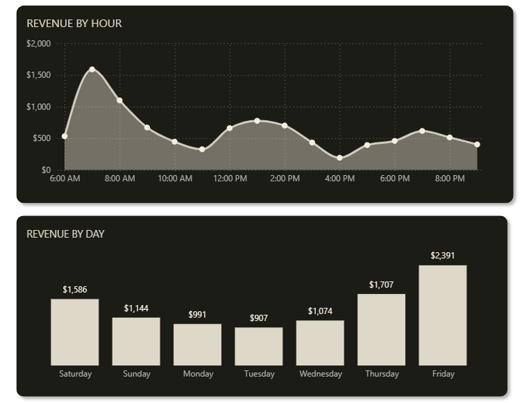
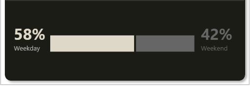
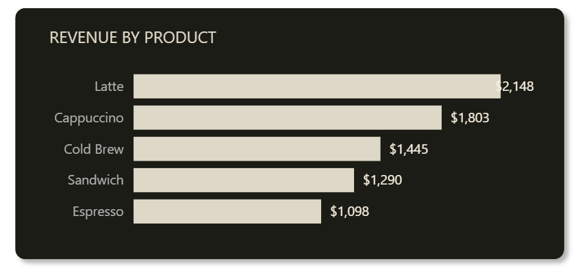
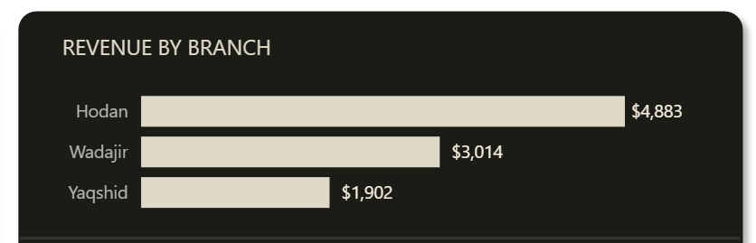

# Barwaaqo Coffee Co. — Sales & Operations Analysis

Barwaaqo Coffee Co. is a Mogadishu-based coffee chain operating across five city branches — Hodan, Wadajir, Medina, Yaqshid, and Karaan. The business runs on a direct in-store retail model and serves customers daily across all locations.

This project analyzes six months of transactional data (2,132 rows, 15 products) to move beyond surface-level reporting and surface the operational and commercial decisions the business should be making — but currently isn't.

**Key areas of analysis:**
- Hourly and monthly revenue patterns across all five branches
- Product profitability ranked by margin, volume, and cost efficiency
- Branch-level performance and revenue concentration risk
- Staff output analysis and shift allocation effectiveness

An interactive Power BI dashboard can be found [here](#).

---

# Executive Summary

Barwaaqo Coffee Co. generated **$1.66M in total revenue** across six months, with a 74.4% profit margin and $219,427 net profit in its peak month alone. The business runs on predictable, stable demand — product rankings never shifted across the entire six-month window — but that stability is masking three structural problems: revenue is dangerously concentrated in one branch, low-margin products are dragging profitability without any corrective strategy, and the highest-performing staff member is being wasted in the lowest-volume location.

---

# Insights Deep Dive

### 1. Peak Hours

The **7–9 AM window generates $102,893** — the single most commercially critical period across all five branches and all six months without exception. Within that window, **9 AM alone produces $34,641**, making it the highest-revenue hour of the day. Revenue then drops sharply: the 10 AM hour records only $14,437 — a 58% fall in a single hour.

A secondary cluster appears at **12–1 PM, generating $45,219**. Latte drives the morning, while Iced Latte leads on margin during the lunchtime window — a meaningful distinction when staffing and ingredient prep decisions are being made.

The 10 AM cliff is not a demand problem. It is a transition problem — customers leave after the morning rush and the business has no mechanism to bridge to lunch. The midday peak exists but is roughly 44% the size of morning, suggesting significant unconverted traffic.

**Recommendation:** Deploy speed-focused, latte-skilled staff specifically for the 7–9 AM window. Restock all ingredients before opening rather than during service. Pre-position Iced Latte ingredients for the 12–1 PM window. Introduce a mid-morning offer (10–11 AM) to reduce the cliff drop and extend the morning revenue curve.

---

### 2. Peak Month

**March is the highest-revenue month at $294,740** — 9.5% above February and the clear outlier across the six-month period. The spike was not a broad-based lift. It was driven by a single product: Latte grew from $53K to $58K between February and March. Four additional products each contributed $1K–$1.5K increases, with Americano providing structural support at an 85% margin. After March, revenue dropped sharply.

The more significant finding is what *didn't* change: product rankings held completely stable across all six months. The same products led every month, in the same order, with no rank movement. This means demand is predictable, but it also means the business is not developing new revenue sources. The top two or three products are carrying everything.

**Recommendation:** Treat March as a planned event, not a surprise. Begin promotional preparation in February across all products — not just Latte. Use March volume to stress-test operations and identify bottlenecks before they appear. Actively work to grow mid-tier products so a single bad Latte month cannot pull total revenue down.

---

### 3. Product Profitability

With 15 products across three categories, the portfolio has a clear hierarchy — and two products sitting at the bottom that need immediate commercial decisions.

**Hot Drinks dominate at 67.3% of total revenue ($1.12M).** The top five by revenue:

| Product | Revenue | Margin | Profit |
|---|---|---|---|
| Latte | $325,819 | 80.7% | $262,915 |
| Cappuccino | $179,391 | 79.8% | $143,171 |
| Americano | $157,433 | 85.4% | $134,402 |
| Chai Latte | $123,269 | 81.9% | — |
| Croissant | $109,864 | 55.0% | — |

**Macchiato carries the highest margin of any product at 85.8%**, yet it does not appear in the top five by revenue — a missed upsell opportunity given that pushing it costs almost nothing in additional ingredients.

**Croissant (54,932 units, $109,864)** sits at a 55% margin, meaning nearly half of every dollar it generates goes to cost. High volume but low margin — it needs either a price adjustment or a bundling strategy to improve its revenue-per-unit contribution.

**Cold Brew (14,222 units, $56,888)** is the weakest product in the portfolio: lowest margin at 45.8% and lowest volume. This is not a pricing problem first — it is an awareness problem. Customers are not ordering it. Marketing comes before repricing.

**Water Bottle (49,644 units, $49,644)** moves high volume at $1 per unit, with half of that going to cost. It functions as a convenience item, not a revenue driver, and should be treated accordingly.

**Recommendations:**
- Run a 30-day price test on Cold Brew and Water Bottle (+$0.50) at one mid-volume branch. If unit sales drop more than 10%, reverse it.
- Bundle Croissant with Latte or Americano as a morning combo to improve its revenue contribution without discounting.
- Train staff to mention Macchiato at point of sale — it is the highest-margin product and currently underexposed.
- Do not discount top products. Protect Latte and Americano margins through upselling and loyalty rewards only.

---

### 4. Revenue by Branch

| Branch | Revenue | Share |
|---|---|---|
| Hodan | $500,591 | 30.1% |
| Wadajir | $332,500 | 20.0% |
| Medina | $314,800 | 18.9% |
| Yaqshid | $261,400 | 15.7% |
| Karaan | $248,920 | 15.0% |

**Hodan generates 30% of total revenue** — nearly double Yaqshid and Karaan individually. Its central business district location drives foot traffic that the other branches cannot match organically.

The problem is concentration risk. A single bad month at Hodan — an operational disruption, a competitor opening nearby, a key staff departure — pulls the entire business down in a way that no other single branch can compensate for. At 30% dependency, Hodan is both the company's biggest asset and its most significant vulnerability.

Yaqshid and Karaan together represent 30.7% of revenue across two branches. Both are residential-area locations where organic walk-in traffic is structurally lower, but that also means loyal repeat customers are more achievable than at a transient business district location.

**Latte in Yaqshid specifically needs a branch-targeted push.** It is the top product everywhere else, and any underperformance there compounds Yaqshid's already weaker volume position.

**Recommendations:**
- Invest in community-focused marketing at Yaqshid and Karaan — loyalty cards, neighbourhood promotions, and local partnerships — to grow the repeat customer base and reduce total revenue dependency on Hodan.
- Do not reallocate Hodan's resources to compensate for other branches. Grow others up, not Hodan down.

---

### 5. Staff Performance

**Saado Axmed is the top-performing staff member by every metric:** $90,650 in revenue, 22,930 orders handled, and 126 orders per shift — the highest orders-per-shift figure across all 28 active staff. She is classified as Medium skill and works at Yaqshid — the lowest-volume branch in the chain.

The staff leaderboard reveals a counterintuitive pattern: **Medium-skill staff consistently outperform High-skill staff** in revenue and orders handled. The instinct is to attribute this to skill, but the data points elsewhere. High-skill staff are deployed during the 7–9 AM morning peak with three to four colleagues. Saado and other top performers work afternoon shifts with one to two colleagues — meaning they handle the full workload of a lower-traffic period alone. The performance gap reflects **shift structure, not skill**.

A second issue: the skill rating system itself appears unreliable if Medium consistently ranks above High across volume, timing, and period controls. That warrants an internal review before it influences any hiring or promotion decisions.

**Recommendations:**
- Rebalance shifts: move one to two staff members from the over-staffed morning peak to afternoon slots where single-staff bottlenecks are absorbing demand.
- Introduce an Employee of the Month framework based on measurable output — revenue generated, orders handled, orders per shift — rather than skill rating alone.
- Investigate the skill classification methodology. If it does not predict performance, it should not be used to make operational decisions.

---

# Recommendations Summary

| Area | Action | Priority |
|---|---|---|
| Peak Hours | Pre-open restock, latte-skilled morning staff, 10–11 AM bridge offer | High |
| Monthly Planning | March prep starts in February; develop mid-tier products | Medium |
| Product Portfolio | Price test Cold Brew +$0.50, bundle Croissant, push Macchiato at POS | High |
| Branch Balance | Marketing investment at Yaqshid and Karaan; do not cut Hodan | Medium |
| Staff Deployment | Rebalance shifts; output-based recognition; review skill rating system | High |
